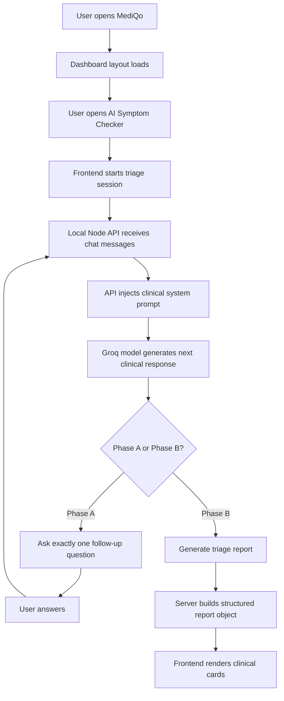
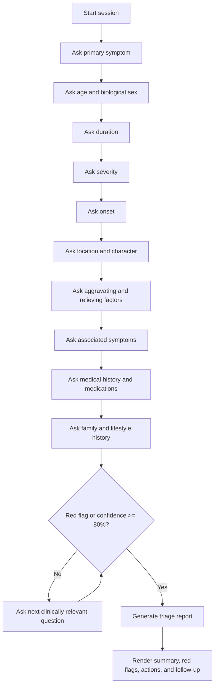
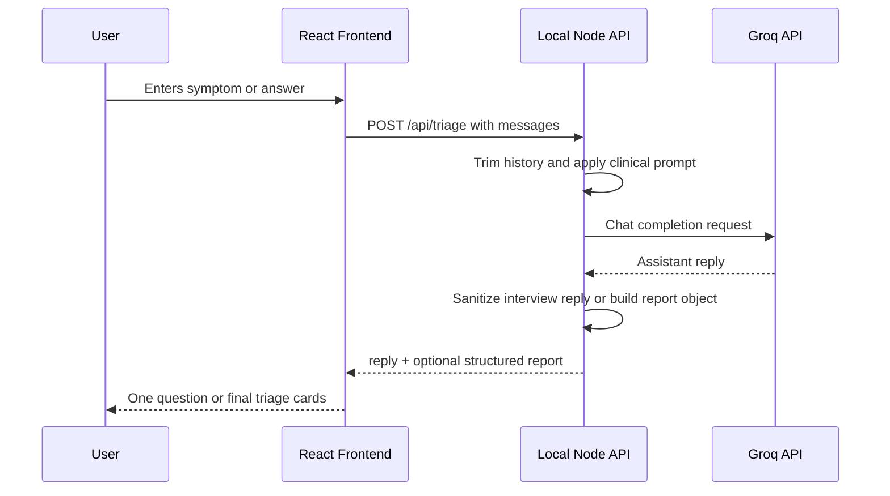
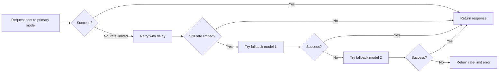

# MediQo Healthcare AI

GitHub repository: [DivyeGautam66/heathcare-with-ai](https://github.com/DivyeGautam66/heathcare-with-ai)

MediQo Healthcare AI is a React and Groq powered clinical triage web app. It guides a patient through a structured symptom interview, asks one follow-up question at a time, detects emergency indicators, and renders the final triage output as clean clinical summary cards.

> Disclaimer: This project is an educational AI triage simulation. It is not a replacement for licensed medical care. If symptoms suggest an emergency, call local emergency services or go to the nearest emergency department.

## Features

- AI symptom checker with a structured clinical interview flow
- One-question-at-a-time triage behavior
- Emergency indicator detection and escalation messaging
- Groq-backed LLM server proxy so API keys are not exposed in the browser
- Automatic Groq model fallback when the primary model is rate-limited
- Clean final triage card with:
  - Patient summary
  - Triage status and confidence
  - Likely cause
  - Important red flags
  - What to do now
  - Follow-up plan
- Vite + React frontend with Framer Motion interactions
- Tailwind CSS setup and responsive dashboard layout

## Tech Stack

| Layer | Technology |
| --- | --- |
| Frontend | React 19, TypeScript, Vite |
| Styling | Tailwind CSS, custom CSS variables |
| Motion | Framer Motion |
| Icons | Lucide React |
| Charts/UI extras | Recharts, react-circular-progressbar |
| Backend proxy | Node.js HTTP server |
| AI provider | Groq Chat Completions API |

## Project Structure

```text
heathcare-with-ai/
|-- public/
|-- server/
|   `-- triage-server.mjs
|-- src/
|   |-- components/
|   |   |-- Layout.tsx
|   |   `-- SOSButton.tsx
|   |-- pages/
|   |   |-- SymptomChecker.tsx
|   |   |-- Dashboard.tsx
|   |   |-- Analytics.tsx
|   |   |-- PatientProfile.tsx
|   |   |-- Telemedicine.tsx
|   |   `-- AdminDashboard.tsx
|   |-- App.tsx
|   |-- main.tsx
|   `-- index.css
|-- .env.example
|-- package.json
|-- tsconfig.json
`-- vite.config.ts
```

## Setup

Install dependencies:

```powershell
npm install
```

Create a `.env` file in the project root:

```env
GROQ_API_KEY=your_groq_api_key_here
GROQ_TRIAGE_MODEL=openai/gpt-oss-120b
GROQ_TRIAGE_FALLBACK_MODELS=llama-3.3-70b-versatile,llama-3.1-8b-instant
TRIAGE_API_PORT=8787
TRIAGE_MAX_HISTORY_MESSAGES=10
TRIAGE_MAX_PROMPT_CHARS=12000
TRIAGE_MAX_COMPLETION_TOKENS=900
TRIAGE_GROQ_MAX_RETRIES=2
TRIAGE_GROQ_RETRY_DELAY_MS=1200
```

Keep `.env` private. Do not commit real API keys to GitHub.

## Running Locally

Start the local triage API server in one terminal:

```powershell
cd C:\Users\ashis\OneDrive\Desktop\Medical_Triage\heathcare-with-ai
npm run api
```

Start the frontend in another terminal:

```powershell
cd C:\Users\ashis\OneDrive\Desktop\Medical_Triage\heathcare-with-ai
npm run dev
```

Open the Vite URL shown in the terminal, usually:

```text
http://localhost:5173
```

Go to:

```text
/symptom-checker
```

## Scripts

| Command | Description |
| --- | --- |
| `npm run api` | Starts the local Groq triage API server |
| `npm run dev` | Starts the Vite frontend |
| `npm run build` | Type-checks and builds the production app |
| `npm run preview` | Serves the built production app locally |

## App Flow



## Triage Interview Flow



## Frontend and Backend Communication



## Model Fallback Flow



## API Endpoints

### `GET /api/health`

Checks whether the local API server is running.

Example response:

```json
{
  "ok": true,
  "model": "openai/gpt-oss-120b",
  "fallbacks": ["llama-3.3-70b-versatile", "llama-3.1-8b-instant"]
}
```

### `POST /api/triage`

Sends the current chat history to the triage engine.

Example request:

```json
{
  "messages": [
    {
      "role": "user",
      "content": "START_SESSION"
    }
  ]
}
```

Example response:

```json
{
  "reply": "1. What is your age and biological sex?",
  "report": null,
  "model": "openai/gpt-oss-120b",
  "usedFallback": false
}
```

When the final triage report is generated, `report` contains structured fields for the UI cards.

## Clinical Report Fields

The final card is rendered from a structured server payload:

| Field | Purpose |
| --- | --- |
| `patientSummary` | Key facts collected during the interview |
| `status` | Triage level such as emergency, urgent, routine, or self-limiting |
| `confidence` | Model confidence estimate |
| `justification` | Short rationale for triage level |
| `diagnosis` | Most likely predicted condition |
| `rationale` | Why the diagnosis fits the user answers |
| `redFlags` | Symptoms that should trigger immediate escalation |
| `actions` | What the user should do now |
| `followUp` | Specialist and tracking guidance |

## Safety Notes

- The app is not a medical device.
- It does not diagnose with certainty.
- It does not replace a physician, emergency service, pharmacist, or licensed clinical professional.
- Emergency symptoms should always be handled by emergency services.
- Do not expose the Groq API key in client-side code.

## Build Check

Run:

```powershell
npm run build
```

A successful build confirms the TypeScript app and Vite production bundle are valid.

## GitHub Ready Checklist

- README includes setup and run commands
- `.env.example` uses placeholders only
- Real `.env` stays private
- API key is handled by the local server only
- Flowcharts render in GitHub via Mermaid
- Frontend build passes with `npm run build`
